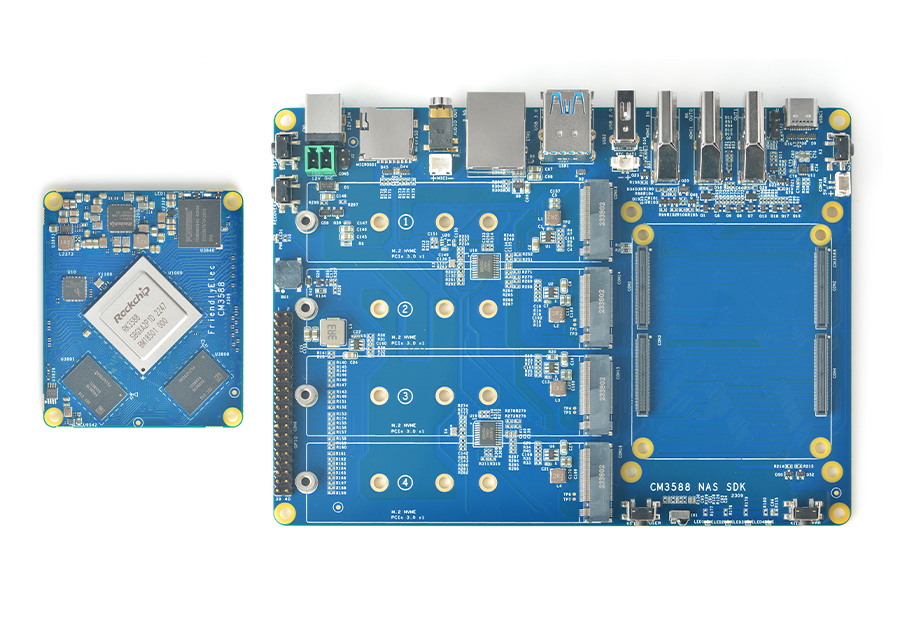
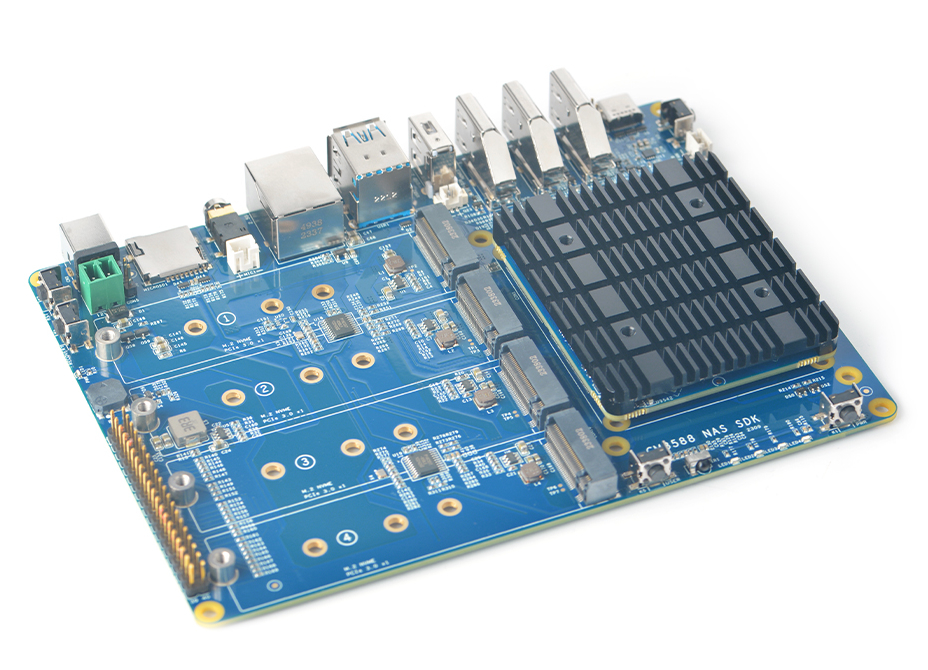

## CM3588 NAS Board Assembly Guide

### Setup Instructions
1. [Installing Open Media Vault OS (Debian 12)](./docs/omv-setup.md)
2. [Setup User](./docs/user-setup.md)
3. [Setup Storage Drives](./docs/storage-setup.md)
4. [Setup NAS Users and Share Folder](./docs/nas-users.md)

### Extra Instructions
* [Docker Setup](./docs/docker-setup.md)

### Assembly Parts for NAS
* [CM3588 NAS Board](https://www.friendlyelec.com/index.php?route=product/product&product_id=294)  

### Cases
* [Remixed case](https://makerworld.com/en/models/469663#profileId-379089) by [DukeChocula](https://github.com/DukeChocula)
    * It was remixed to use these [Fan](https://www.amazon.com/Noctua-Cooling-Bearing-NF-A4X10-FLX-5V/dp/B00NEMGCIA) that uses M5.5 screws
    * The case also used this [Data/Power Splitter](https://www.amazon.com/gp/product/B09CYGW46K/?th=1) but it's not necessary if you already have the cables.
* [Top Fan Case](https://www.printables.com/model/975231-friendlyelec-cm3588-nas-case) for CPU by [Nighthater](https://github.com/Nighthater).
* You can also go on Amazon and lookup `CM3588 Case` and you'll find something.

## Resources
* [RK3588 Drive](https://drive.google.com/drive/folders/1FoBbP_nPkMehwBj4wHwsbRU-QGjEdeEP) from FriendlyElec
* [CM3588 Wiki](https://wiki.friendlyelec.com/wiki/index.php/CM3588)