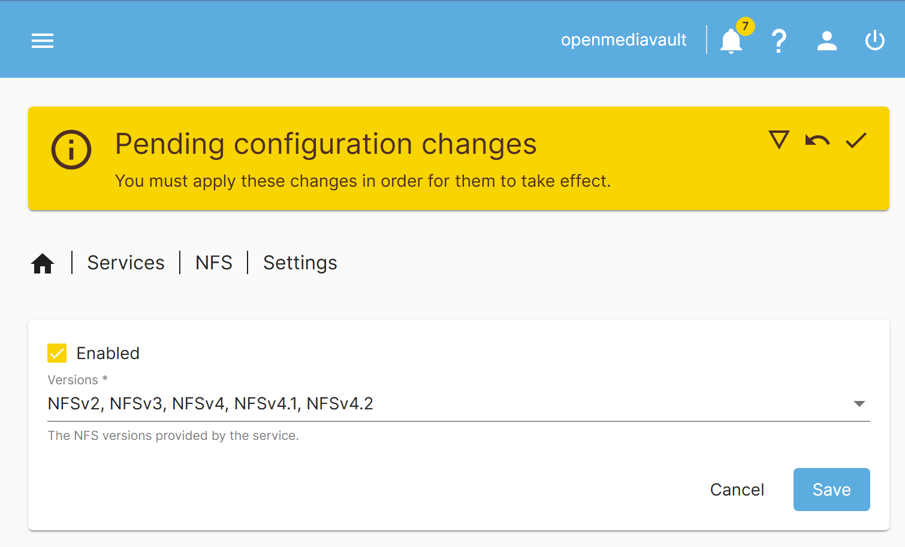

## Create NAS Users and Share Folder

### Create NAS Users
1. Navigate to the `Users -> Groups` tab and click the `+` icon to and create a group name with based on the name you will give your user.

2. Navigate to the `Users -> Users` tab and click the `+` icon to create a user of your choice of name. Just add the `users` group to this user.

### Create an NFS share
3. Navigate to `Services -> NFS -> Settings` and check the Enabled box. Select all versions and include `NFSv2` then click `Save`.



4. Navigate to `Services -> NFS -> Shares` tab and click on the `+` icon.

5. Select your share folder.

6. Set your Client. Typically it's something like `X.X.X.0/24` where `X` is some number part of your IP between (typically) `10-255`.

```
ipconfig (Windows)

ip a (Linux)
```

7. Set `Permission` to `Read/Write`.

8. Set `Extra Options` to:

```
rw,async,insecure,no_subtree_check,all_squash,anonuid=0,anongid=0
```

9. Then click `Save`.

### Create a Samba share
10. Navigate to the `Services -> SMB/CIFS -> Settings` tab and check off `Enabled`.

11. Select `SMB1` as the minimum protocol version. Then click `Save`.

12. Navigate to the `Services -> SMB/CIFS/ Shares` tab and click the `+` icon.

13. In the `Share folder` field, select the folder you want to share.

### Additional Testing for Macs
14. On a Mac system, right-click `Finder`, select `Connect to Server`, and enter `smb://<ip-address>`. An authentication dialog will appear; enter the username and password to access the share.

15. At this point you should be able to log into your NAS through the `Network` option on Windows.

16. You can refer back to the [readme](../README.md) for additional setup.
