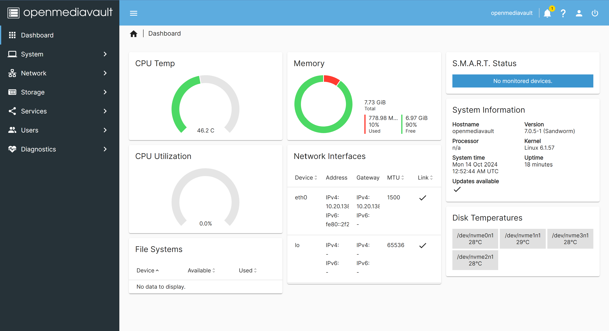

# Open Media Vault CM3588 Guide

* [Open Media Vault](https://www.openmediavault.org/)
* [OMV with FriendlyElec](https://wiki.friendlyelec.com/wiki/index.php/Getting_Started_with_OpenMediaVault#Supported_platforms)

### Create Bootable Drive
1. You'll need a minimum of 8GB of space for the boot drive.

2. You can grab a image [here](https://drive.google.com/drive/folders/1k5M_5s10M_HOoFb-_uZ80_7d6quG7hli) to get the SD to eMMC image. If you do not have eMMC, then go [here](https://drive.google.com/drive/folders/16A7h0AMiMjq6Y13tqHoZsrY53THHELIz) for the OMV image download.

3. You can use [Rufus](https://rufus.ie/en/) for writing to the microSD card. It'll probably take some time depending on your microSD or SD card converter (or if it is built in).

4. Now insert your micoSD card into the CM3588 board sd slot. It should not take too long to write it (at most 5 minutes or at best 30 seconds). If you want to track progress, just use the hdmi out port into a monitor and it should show the progress.

5. Power down the board and restart it. 
    * If you did not get eMMC storage, you will have to leave the microSD in for when you need to boot it.

6. Plug in your ethernet so it can be on the network.

### Connecting to the Board

1. After you re-powered on the board, you can now log in using the two default users created.

| Username | Password | has sudo? |
|----------|----------|-----------|
| pi       | pi       | Yes       |
| root     | fa       | No        |

2. You can just log in as `pi`.

3. I recommend running `sudo apt-get update` to refresh the package lists defined in the system.
    * If you would like to run `sudo apt-get upgrade`, it will install the updates for your installed packages.

4. To get the IP address, you can run `ip a` and check for the `eth0` address.

5. Use your IP address and lookup the web interface.
  * Let's say the IP is `10.5.42.6`, then you'd lookup `http://10.5.42.6/`. You should see something like this below, but not customized.

6. Now you can follow [user setup](../docs/user-setup.md).
