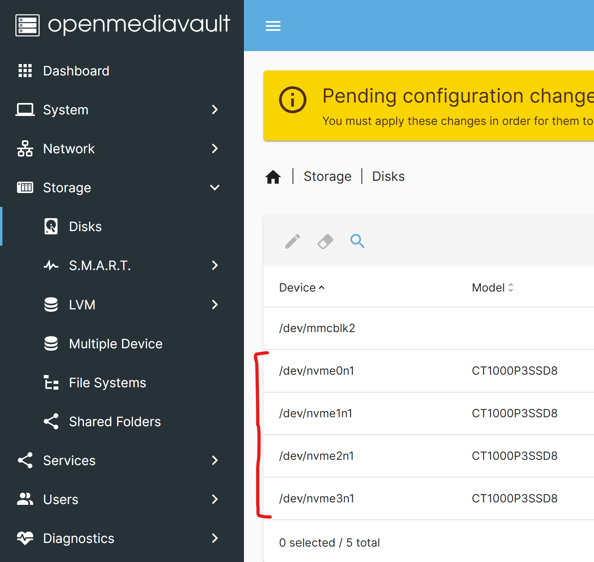

## Setup Storage Drives
Since we have 4 one lane m.2 slots, we should format them for the board.

### Wipe Drives
If you have sensitive data, I would not recommend doing this.

1. Log into the web interface for the OMV NAS and log in with the base credentials. The password is default and can be changed on the NAS when logging in.

```
username: admin
password: openmediavault
```

2. Navigate to `Storage -> Disks` to see your disks. If you have eMMC storage, it should appear first. The rest you can clear by clicking on them.




3. You can do the `Quick` wipe to clean your disks. `Secure` will take awhile if you want to ensure your data is gone.

> [!IMPORTANT]
> You will see the following image from time to time. Just apply the changes.
>
> 

## Setup File System
Based on the [OMV Wiki by FriendlyElec](https://wiki.friendlyelec.com/wiki/index.php/Getting_Started_with_OpenMediaVault#OpenMediaVault_version) you can set it up in two ways. I set up MD RAID.

* **MD RAID**: has better performance, because it does a better job of parallelizing writes and striping reads.
* **Btrfs RAID**: has better data safety, because the checksumming lets it ID which copy of a block is wrong when only one is wrong, and means it can tell if both copies are bad.

> [!NOTE]  
> OMV does not support RAID for USB-connected devices, for more details, please refer to the [official RAID guide](https://docs.openmediavault.org/en/latest/administration/storage/raid.html)

### Setup MD RAID (Option 1)
4. Navigate to the `Storage -> Multiple Device` tab.


5. Click on the plus button and choose your `Level` and `Devices` you want. Then save:


6. The sync could take awhile (took about an 1.33 hours for me) and wait until you see that the `state` is `clean`.

### Setup BTRFS with RAID (Option 1 Part 2)
7. Navigate to the `Storage -> File Systems` tab and click the `+` icon then choose `BTRFS`.

8. Select `Single` and your MD RAID Device then click `Save`.


### Setup BTRFS Only (Option 2)
9. Navigate to the `Storage -> File Systems` tab and click the `+` icon then choose `BTRFS`.

10. Select `Single` and your storage device(s) then click `Save`.

## Create Shared Folders
11. Navigate to `Storage -> Shared Folders` and click the `+` icon.

12. Give a `Name` for your folder. Choose the `File System` you created. The `Relative path` will automatically be created based on the `Name`. I choose the permission with `Others` having `no access`.

### Permissions Table

| Administrator | Users      | Others     |
|---------------|------------|------------|
| read/write    | no access  | no access  |
| read/write    | read-only  | no access  |
| read/write    | read/write | no access  |
| read/write    | read-only  | read-only  |
| read/write    | read/write | read-only  |
| read/write    | read/write | read/write |

13. Click `Save` when you are done.

14. Proceed to creating [NAS Users and the NFS share](./nas-users.md).